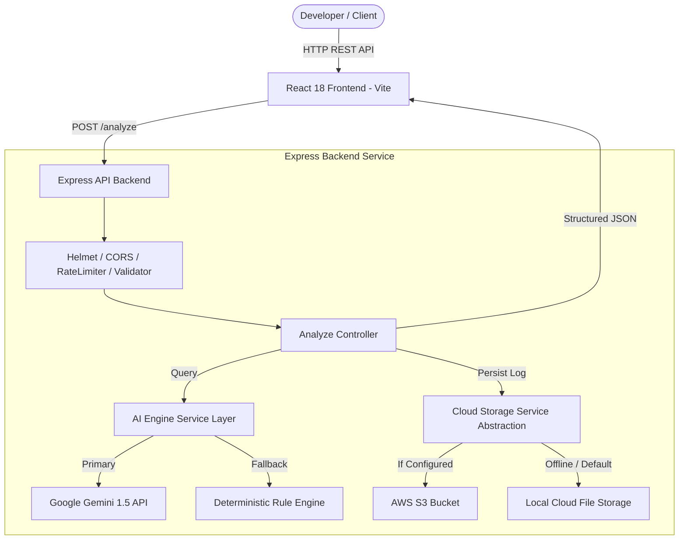

# StackFix AI — Enterprise Production-Grade AI Debugging SaaS Platform

[](https://github.com/Dhanya562004/Stack-fix/actions)
[](https://opensource.org/licenses/MIT)
[](https://nodejs.org/)
[](https://expressjs.com/)
[](https://reactjs.org/)
[](https://aistudio.google.com/)
[](https://aws.amazon.com/s3/)

StackFix AI is a production-grade developer SaaS platform designed to analyze programming errors, runtime exceptions, and compiler stack traces. It combines Large Language Models (Google Gemini API `gemini-1.5-flash`) with an intelligent deterministic fallback engine, cloud storage architecture (AWS S3), comprehensive CI/CD pipelines, and automated Jest test suites.

---

## 🏗️ System Architecture



---

## ⚡ Core Features

- **Multi-Language AI Diagnostics:** Analyzes Python, JavaScript, TypeScript, Java, C++, Go, and Rust stack traces.
- **Structured AI Analysis:** Returns Root Cause, Clear Issue Explanation, Step-by-Step Action Plan, and Corrected Code.
- **Dual AI Engine Architecture:** Primary execution via Google Gemini 1.5 Flash API with intelligent deterministic fallback engine ensuring 100% uptime.
- **Cloud S3 Storage Layer:** Persists all debugging logs and session data to AWS S3 (or local cloud abstraction layer).
- **Enterprise DevOps Setup:** Winston structured JSON logging, Morgan HTTP request logging, Helmet security headers, rate limiting, and input validation.
- **Automated Testing Suite:** Integration & Unit tests powered by Jest + Supertest with high code coverage.
- **CI/CD Pipeline:** Fully automated GitHub Actions workflow (`.github/workflows/ci.yml`) for multi-version Node testing, linting, and building.
- **Production UI:** Glassmorphism dark mode React UI featuring code editor, sample presets, side-by-side code diff viewer, copy-to-clipboard, and history drawer.

---

## 🛠️ Tech Stack

| Layer | Technology |
|---|---|
| **Frontend** | React 18, Vite, Tailwind CSS, Lucide Icons |
| **Backend API** | Node.js (v20), Express.js, Helmet, Morgan, Winston |
| **AI Layer** | Google Gemini API (`gemini-1.5-flash`) + Heuristic Engine |
| **Cloud Storage** | AWS S3 (`@aws-sdk/client-s3`) & Local Abstraction |
| **Testing** | Jest, Supertest |
| **DevOps & CI/CD** | Docker, Docker Compose, GitHub Actions |

---

## 📁 Repository Structure

```
StackFix/
├── .github/
│   └── workflows/
│       └── ci.yml             # GitHub Actions CI/CD Pipeline
├── backend/
│   └── src/
│       ├── config/            # Centralized Environment Config
│       ├── controllers/       # API Controllers (Analyze, Health, History)
│       ├── middleware/        # Error Handling, Validation, Logger
│       ├── routes/            # Express API Routes (/analyze, /health)
│       ├── services/          # AI Service (Gemini) & Storage Service (S3)
│       ├── utils/             # Winston Logger Utility
│       └── server.js          # Express Application Entrypoint
├── frontend/                  # React + Vite Frontend Application
│   ├── src/
│   │   ├── components/        # Header, CodeEditor, AnalysisResult, HistoryDrawer
│   │   ├── services/          # API Client Layer
│   │   ├── App.jsx
│   │   └── index.css          # Glassmorphism Design System
│   ├── vercel.json            # Vercel Deployment Routing Config
│   └── vite.config.js
├── tests/                     # Automated Jest + Supertest Suites
│   ├── analyze.test.js        # POST /analyze API Integration Tests
│   ├── health.test.js         # GET /health System Metrics Tests
│   └── storage.test.js        # Storage Layer Unit Tests
├── Dockerfile                 # Multi-stage Container Build
├── docker-compose.yml         # Container Orchestration
├── jest.config.js             # Jest Configuration
├── package.json               # Root Package & Orchestration Scripts
├── .env.example               # Environment Variables Template
└── README.md                  # Project Documentation
```

---

## 🚀 Quick Start Guide

### 1. Prerequisites
- Node.js v18.x or v20.x
- npm v9+ or yarn

### 2. Environment Configuration
Copy the template `.env.example` to `.env`:
```bash
cp .env.example .env
```
Edit `.env` to supply your API keys (optional - works in fallback mode without keys):
```env
PORT=5000
NODE_ENV=development
GEMINI_API_KEY=your_gemini_api_key_here
GEMINI_MODEL=gemini-1.5-flash
```

### 3. Install Dependencies
```bash
npm run install:all
```

### 4. Run Development Servers
To start both Backend API and React Frontend concurrently:
```bash
npm run dev
```
- **Frontend App:** `http://localhost:5173`
- **Backend API:** `http://localhost:5000`

---

## 🧪 Testing & Quality Assurance

Run the automated Jest test suite covering API endpoints, input validation, fallback logic, and cloud storage:

```bash
npm test
```

Generate full code coverage report:
```bash
npm run test:coverage
```

---

## 🐳 Docker Deployment

Build and run using Docker Compose:

```bash
docker-compose up --build -d
```
The application will be accessible at `http://localhost:5000`.

---

## 📡 API Reference

### `POST /analyze`
Analyzes a code snippet and error stack trace.

**Request Body:**
```json
{
  "code": "name = \"Alex\"\nprint(\"Hello \" + username)",
  "error": "NameError: name 'username' is not defined",
  "language": "python"
}
```

**Response (200 OK):**
```json
{
  "success": true,
  "data": {
    "id": "analysis-a1b2c3d4",
    "timestamp": "2026-09-27T12:00:00.000Z",
    "analysis": {
      "rootCause": "The variable 'username' is referenced but was not defined in scope.",
      "explanation": "You assigned value 'Alex' to variable 'name', but referenced 'username' in print statement.",
      "fixSteps": [
        "Change 'username' to 'name' in print statement.",
        "Ensure variable is initialized before reference."
      ],
      "fixedCode": "name = \"Alex\"\nprint(\"Hello \" + name)",
      "confidenceScore": 0.95
    },
    "metadata": {
      "executionTimeMs": 18,
      "mode": "gemini_ai",
      "model": "gemini-1.5-flash"
    }
  },
  "storage": {
    "storage": "aws_s3",
    "key": "analyses/2026-09-27/analysis-a1b2c3d4.json"
  }
}
```

### `GET /health`
Returns live health status, memory usage, uptime, Gemini API connection, and cloud storage status.

---

## 🌐 Production Deployment Steps

### Backend (Render / Railway / AWS ECS)
1. Set Environment Variables: `PORT`, `NODE_ENV=production`, `GEMINI_API_KEY`, `AWS_ACCESS_KEY_ID`, `AWS_SECRET_ACCESS_KEY`.
2. Build Command: `npm --prefix backend install`
3. Start Command: `node backend/src/server.js`

### Frontend (Vercel / Netlify)
1. Root Directory: `frontend`
2. Build Command: `npm run build`
3. Output Directory: `dist`
4. Set Environment Variable: `VITE_API_BASE_URL=https://your-backend-api.onrender.com`

---

## 📄 License
MIT License. Created by Dhanya.
